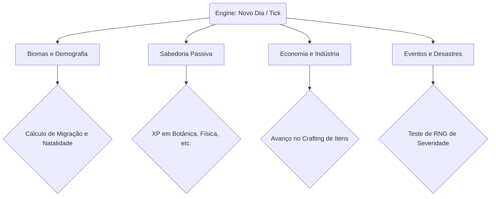
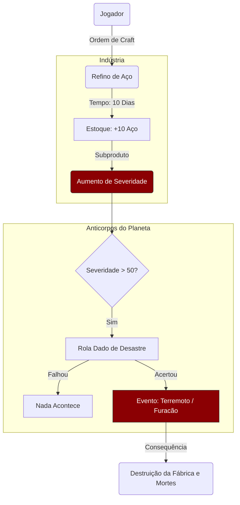
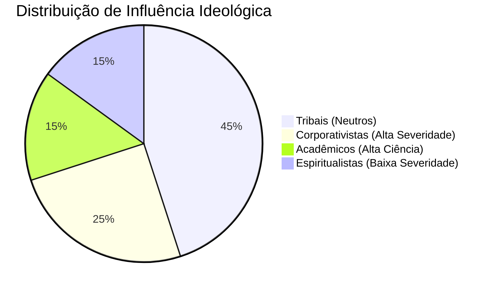

# Fluxo de Sistemas (A Arquitetura Viva)

Este documento mapeia como as engrenagens da Simulação 3.0 se conectam, desde o clique do jogador até o colapso de uma civilização, utilizando diagramas visuais.

## 1. O Motor Central (O Pulso do Universo)

A `Engine` atua como o coração matemático do jogo. A cada dia (Tick), ela acorda todos os subsistemas em uma ordem estrita.



## 2. A Rede Neural de Conhecimento e a Árvore da Vida

O sistema mais complexo do jogo envolve como a Humanidade aprende. O conhecimento não é mágico; ele brota das ações orgânicas das **Facções** vivendo em seus **Biomas**.

```mermaid
graph LR
    subgraph Ações Orgânicas
    M(Megalópoles Ativas) -->|Gera XP Diário| S(Sociologia)
    D(População no Deserto) -->|Gera XP Diário| H(Engenharia Hídrica)
    F(Facção Espiritualista) -->|Gera XP Diário| B(Botânica)
    end
    
    subgraph Sabedoria Passiva (0 a 100%)
    S
    H
    B
    end
    
    subgraph Árvore da Vida (Tech Ativa)
    B -.->|Reduz o Custo em 50%| M1[Medicina Básica]
    B -.->|Reduz o Custo em 30%| A1[Agricultura]
    H -.->|Desbloqueia| I1[Irrigação Profunda]
    end
    
    style S fill:#223344,stroke:#333
    style H fill:#223344,stroke:#333
    style B fill:#223344,stroke:#333
    style M1 fill:#1b4a3c,stroke:#2d7d65
```

## 3. O Ciclo Econômico e a Fúria Planetária

À medida que a humanidade acelera seu consumo por meio da forja de novas receitas, a **Severidade** (o rastro de destruição e poluição) aumenta. O planeta monitora a Severidade e responde enviando Anticorpos.



## 4. O Sistema de Tensores Sociológicos (Facções)

A matriz demográfica não é apenas um número de humanos. Ela é um tensor de facções que lutam pelo controle ideológico.



Se os Corporativistas forem maioria, a velocidade de mineração é multiplicada, mas a Severidade escala violentamente, desencadeando a Fúria Planetária. Se os Espiritualistas assumirem o controle, o avanço tecnológico físico (como Fissão Nuclear) se tornará extremamente caro em DNA, mas a natureza ficará em paz.
